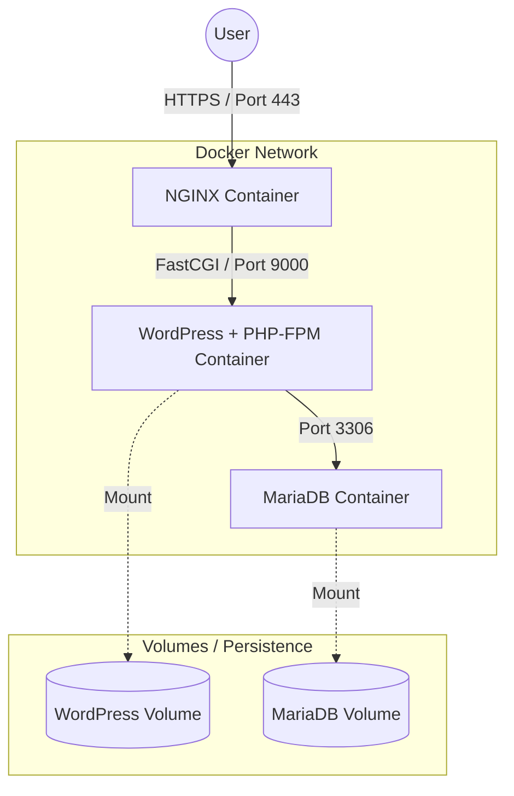

# 🐳 Inception - Docker System Administration

> "Stop saying 'it works on my machine'. Ship your machine."

[](https://www.docker.com/)
[](https://nginx.org/)
[](https://www.alpinelinux.org/)

## ☁️ Overview

**Inception** is a System Administration project focused on virtualization and containerization using **Docker**. The goal is to set up a small infrastructure composed of different services using strict rules: no pre-built images (everything built from `Dockerfiles`), data persistence via volumes, and service isolation via strict networking.

This project simulates a real-world microservices deployment where each component (Web Server, Database, Application) runs in its own isolated container, orchestrated by **Docker Compose**.

---

## 🏗️ Infrastructure Architecture

The setup consists of three main containers communicating through a private internal network, with only the secured port (443) exposed to the outside world.



### 📦 Services
1.  **NGINX (TLSv1.2/1.3):** Acts as the entry point and reverse proxy. It handles SSL/TLS termination using self-signed certificates and forwards PHP requests to the WordPress container.
2.  **WordPress + PHP-FPM:** The application layer. Instead of using Apache, it runs on PHP-FPM to communicate efficiently with Nginx via FastCGI.
3.  **MariaDB:** The database layer. Completely isolated from the outside world; only the WordPress container can talk to it.

---

## 🧠 Technical Highlights

* **Dockerfiles from Scratch:** No "latest" images allowed. Each image is built manually starting from **Alpine Linux** (Penultimate version) to ensure a minimal footprint and maximum security.
* **PID 1 Management:** Understanding how Docker handles processes and why creating a custom entrypoint script is crucial for service startup and signal handling.
* **Data Persistence:** Use of Docker Volumes to ensure that the database and website data survive container restarts or removals.
* **Network Isolation:** Services communicate via a dedicated docker-network. The database is never exposed to the host machine.

---

## 🛠️ Installation & Usage

### Prerequisites
* Docker Engine & Docker Compose installed.
* Make.
* *Note: Sudo privileges might be required depending on your docker group configuration.*

### How to Run
The entire infrastructure is automated via a Makefile.

```bash
# 1. Clone the repository
git clone [https://github.com/grabier/inception.git](https://github.com/grabier/inception.git)

# 2. Enter directory
cd inception

# 3. Build and launch the containers
# This will setup the volumes and build images from scratch
make
```

### Accessing the Site
Since this project uses a local domain, you must add it to your `/etc/hosts` file (if not already done by the setup script):
```bash
127.0.0.1       gmontoro.42.fr
```

* Open your browser and go to: `https://gmontoro.42.fr`
* (Accept the security warning for the self-signed certificate).

---

## 🧹 Maintenance

```bash
# Stop containers
make down

# Stop and remove containers, networks, and images
make clean

# Nuke everything (including persistent data volumes)
make fclean
```
